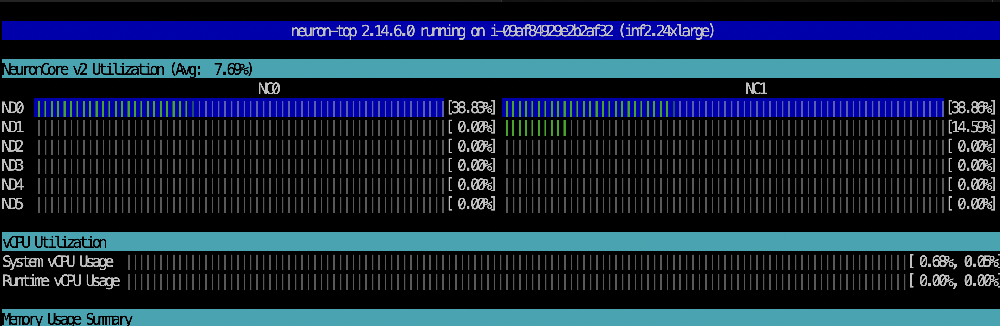
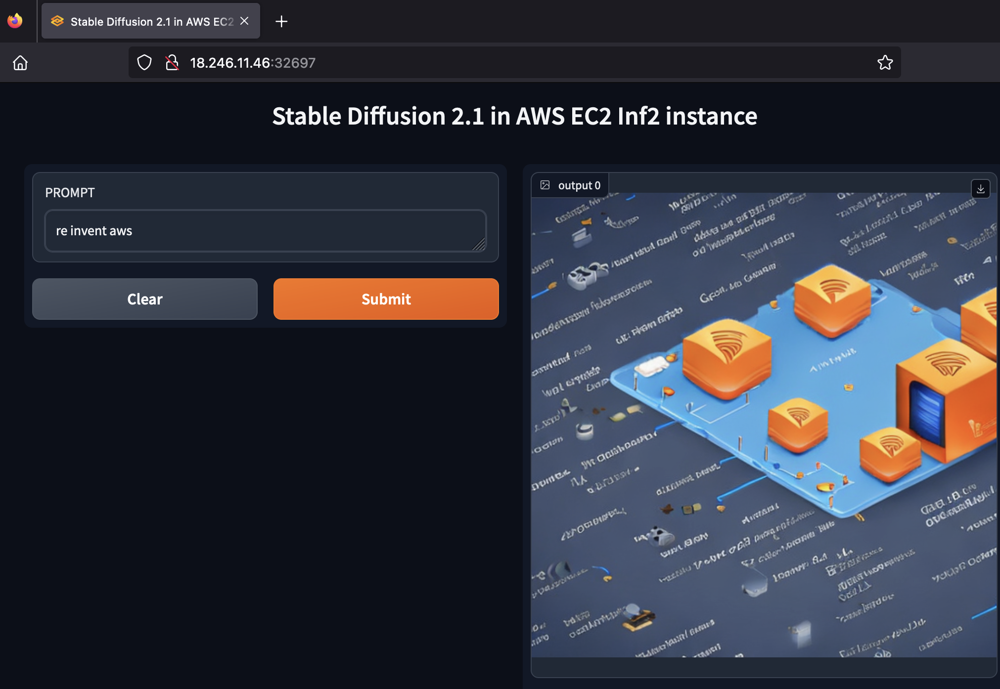
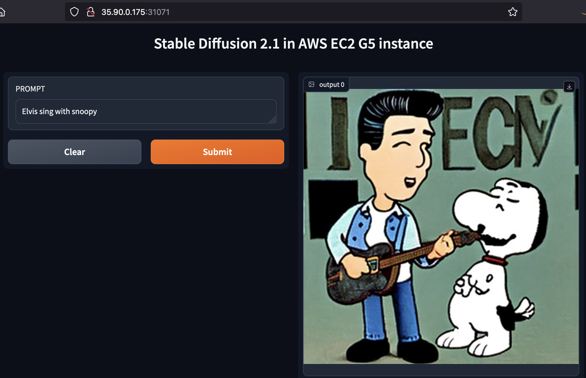

# edge_diffusion inferences
Images, audio, and video content in augmented reality (AR) applications must be generated within milliseconds. Therefore, AR applications generate digital content on-device, but quality is limited by device capabilities. However, content created on a remote server with enough resources takes sub-seconds to be served. As on-device models enrich, this trend pushes inference capabilities back to the cloud within the submillisecond timeframe that cloud edge services such as CDN and LocalZone offer.

This example shows how AR app developers can decouple content quality from hardware by hosting models like Stable Diffusion by Stability AI on a chip such as NVIDIA or Neuron-based AI accelerators as close to the user device as possible.  

You compile and deploy Stable Diffusion 2.1 on EKS in LocalZone to 1/ reduce deploy-time by caching 20GB model's graph artifacts on LocalZone with Docker multi-stage. 2/ simplify a secured network path between the user device and remote server with K8s node-port service; and finally 3/ run the model on any compatible and available AI accelerators. 

[build-time] This sample starts with the build pipeline that compiles the PyTorch code into optimized lower level hardware specific code to accelerate inference on GPU and Neuron-enabled instances. This model compiler utilizes neuron(torch_neuronx) or GPU specific features such as mixed precision support, performance optimized kernels, and minimized communication between the CPU and AI accelerator. The output Docker images are stored in regional image registers (ECR) and ready to deploy. We use Volcano, a Kubernetes native batch scheduler, to improve inference pipline orchestration.

The build phase compiles the model and stores it in S3. In [Dockerfile-assets](./app/Dockerfile-assets), models are pulled from S3 and stored as Docker image layers. i.e., neuron model are pulled for Inf2 images and CUDA model pulled for GPU images with the same Dockerfile. Note that usig if statement in RUN section will not cache the model. 

```
ARG ai_chip

FROM public.ecr.aws/docker/library/python:latest as base

FROM base AS assets-amd64-cuda
ENV VAR=cuda

FROM base AS assets-amd64-neuron
ENV VAR=xla

FROM assets-${ai_chip} AS final
RUN wget https://sdinfer.s3.us-west-2.amazonaws.com/sd2_compile_dir_512_${VAR}.tar.gz -O /model.tar.gz
```

Then, the SDK binaries are loaded at the next stage into the relevant [AWS deep-learning containers] (https://github.com/aws/deep-learning-containers).

[deploy-time] Next, EKS will instanciate the Docker image on EC2 instances launched by Karpenter based on availability, performance and cost policies. The inference endpoint uses a NodePort-based K8s service endpoint behind an EC2 security group. Each available endpoint is published to inference endpoints inventory that is pulled by the user device for ad-hoc inference.  

[run-time] KEDA will control K8s deployment size based on specific AI accelerator usage at run-time. Karpenter terminates unused pods to reclaim compute capacity.

## Setup
* [Create EKS cluster and deploy Karpenter](https://karpenter.sh/docs/getting-started/getting-started-with-karpenter/) 
* Use Service Quotas console to allocate Amazon Elastic Compute Cloud (Amazon EC2) "Running On-Demand Inf instances" and "Running On-Demand G and VT instances" limits.
* Configure NodePools to set Inferentia2 and G EC2 instances constraints 
  ```bash
  kubectl apply -f amd-neuron-provisioner.yaml
  ```
* Deploy the [Volcano CRD](https://volcano.sh/en/docs/installation/)
* Deploy [KEDA](https://keda.sh)
* Deploy [Container Insights on Amazon EKS](https://docs.aws.amazon.com/AmazonCloudWatch/latest/monitoring/Container-Insights-setup-EKS-quickstart.html)
* Deploy [NVIDIA device plugin for Kubernetes](https://github.com/NVIDIA/k8s-device-plugin)
  ```bash
  kubectl create -f https://raw.githubusercontent.com/NVIDIA/k8s-device-plugin/v0.14.1/nvidia-device-plugin.yml
  ```
* Deploy [Neuron device plugin for Kubernetes](https://awsdocs-neuron.readthedocs-hosted.com/en/latest/containers/tutorials/k8s-setup.html#tutorial-k8s-env-setup-for-neuron)
  ```bash
  kubectl apply -f k8s-neuron-device-plugin-rbac.yml
  kubectl apply -f k8s-neuron-device-plugin-ds.yml
  ```

## Build multi-arch CPU and accelerator image
The build process creates OCI images for x86-based instances. You add another build step to create OCI images for Graviton-based instances. This new build process creates a OCI image manifest list that references both OCI images. The container runtime (Docker Engine or containerd) will pull the correct platform-specific image at deployment time. To automate the OCI image build process, we use AWS CodePipeline. AWS CodePipeline starts by building a OCI image from the code in AWS CodeBuild that is pushed to Amazon Elastic Container Registry (Amazon ECR). 

* [Deploy the CI-pipeline of the Stable Diffusion image](./ci-build)

* Create Docker images that supports x86, Gravtion, Neuorn and GPUs (TBD with Volcano pipeline)
  ```bash
  kubectl apply -f sd-inf2-compile-job.yaml
  ```
## Deploy the inference pipeline
* Deploy Karpenter NodePools for Inf2 and G instances
  ```bash
  kubectl apply -f amd-nvidia-provisioner.yaml
  kubectl apply -f amd-neuorn-provisioner.yaml
  ```

* Deploy KEDA ScaledObject
TBD

* Deploy inference endpoint in a region
  ```bash
  kubectl apply -f sd-inf2-serve-deploy.yaml
  ```

* Discover the inference endpoint
  ```bash
  kubectl get svc
  ```
  e.g.,
```
  $kubectl get svc
NAME                                                          TYPE        CLUSTER-IP      EXTERNAL-IP   PORT(S)          AGE
kubernetes                                                    ClusterIP   10.100.0.1      <none>        443/TCP          64d
stablediffusion-serve-inf-56dbffc68c-zcphj-svc-18-246-11-46   NodePort    10.100.228.62   <none>        7860:32697/TCP   2d20h
```
The endpoint is `http://18.246.11.46:32697/`. Observe the AI chips utilization e.g., neuron-top

```bash
kubectl exec -it stablediffusion-serve-inf-56dbffc68c-zcphj -- neuron-top
```
Feel the prompt and enjoy the images generated. Note the the processing time. We will need that for the LocalZoe case.



* Deploy inference endpoint with NVIDIA G5 (G4dn is not supported by Stable Diffusion)
  ```bash
  kubectl apply -f sd-gpu-serve-deploy.yaml
  ```
Wait few minutes for the node provisioning and pod startup and discover the new service
  ```bash
  kubectl get svc
  ```
e.g., 
```
kubectl get svc
NAME                                                          TYPE        CLUSTER-IP       EXTERNAL-IP   PORT(S)          AGE
kubernetes                                                    ClusterIP   10.100.0.1       <none>        443/TCP          66d
stablediffusion-serve-gpu-857c86776d-2wpb6-svc-35-90-0-175    NodePort    10.100.117.207   <none>        7860:31071/TCP   9m18s
stablediffusion-serve-inf-56dbffc68c-zcphj-svc-18-246-11-46   NodePort    10.100.228.62    <none>        7860:32697/TCP   4d17h
```
The relevant service is `stablediffusion-serve-gpu-857c86776d-2wpb6-svc-35-90-0-175`. Endpoint is `http://35.90.0.175:31071`

Observe the NVIDIA core usage while generating an image by:

```bash
watch kubectl exec -it stablediffusion-serve-gpu-857c86776d-2wpb6 -- nvidia-smi

Fri Dec  1 16:50:41 2023       
+---------------------------------------------------------------------------------------+
| NVIDIA-SMI 535.54.03              Driver Version: 535.54.03    CUDA Version: 12.2     |
|-----------------------------------------+----------------------+----------------------+
| GPU  Name                 Persistence-M | Bus-Id        Disp.A | Volatile Uncorr. ECC |
| Fan  Temp   Perf          Pwr:Usage/Cap |         Memory-Usage | GPU-Util  Compute M. |
|                                         |                      |               MIG M. |
|=========================================+======================+======================|
|   0  NVIDIA A10G                    On  | 00000000:00:1B.0 Off |                    0 |
|  0%   33C    P0             222W / 300W |   3930MiB / 23028MiB |     99%      Default |
|                                         |                      |                  N/A |
+-----------------------------------------+----------------------+----------------------+
|   1  NVIDIA A10G                    On  | 00000000:00:1C.0 Off |                    0 |
|  0%   16C    P8              18W / 300W |      7MiB / 23028MiB |      0%      Default |
|                                         |                      |                  N/A |
+-----------------------------------------+----------------------+----------------------+
|   2  NVIDIA A10G                    On  | 00000000:00:1D.0 Off |                    0 |
|  0%   17C    P8              15W / 300W |      7MiB / 23028MiB |      0%      Default |
|                                         |                      |                  N/A |
+-----------------------------------------+----------------------+----------------------+
|   3  NVIDIA A10G                    On  | 00000000:00:1E.0 Off |                    0 |
|  0%   16C    P8               9W / 300W |      7MiB / 23028MiB |      0%      Default |
|                                         |                      |                  N/A |
+-----------------------------------------+----------------------+----------------------+
                                                                                         
+---------------------------------------------------------------------------------------+
| Processes:                                                                            |
|  GPU   GI   CI        PID   Type   Process name                            GPU Memory |
|        ID   ID                                                             Usage      |
|=======================================================================================|
+---------------------------------------------------------------------------------------+
```
Note the first GPU core and memory utilization. 



* Deploy node pools on LocalZone
TBD
